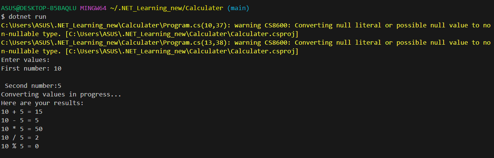

# Calculater

This project shows how can I can successfully use data types &amp; arithmetic operations

Have a look at `Program.cs` file and you can see how I have used:

* Console input/output
* Conversion between data types
* Arithmetic operations

## Demo

